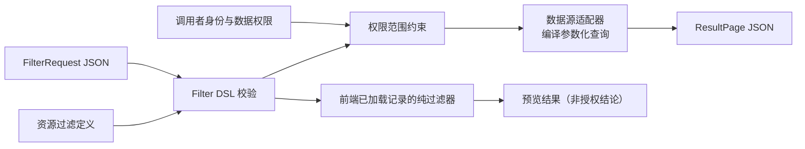

# 数据过滤设计（草案）

> 状态：草案，待确认首个数据源适配器
>
> 范围：前端预览与 Java 后端查询共用的数据过滤、排序与分页契约
>
> 最后更新：2026-08-17

## 1. 目标与非目标

本设计为列表、检索和报表提供一个可保存、可审计、可在浏览器与服务端一致解释的 JSON 过滤
请求。它把**用户可表达的条件**与**数据源可执行的查询**分开：前端可以对已加载数据进行预览，
后端负责在授权范围内将同一条件编译为数据库或远程服务查询。

目标：

- 只接受 JSON-compatible 的过滤条件，具有版本化、明确的空值、数字和日期语义；
- 支持字段比较、集合匹配、字符串匹配、逻辑组合、稳定排序和 cursor 分页；
- 由资源定义声明可过滤、可排序字段及其类型，不能由请求决定字段路径、SQL 或表达式函数；
- 后端始终执行权限范围约束，前端过滤只用于体验优化，不能作为授权依据；
- 过滤 DSL 的解释、错误对象和测试向量在 Java 与 TypeScript 中保持一致。

非目标：全文检索、任意 SQL/JPQL、跨资源 join、聚合/分组、请求中携带 FEEL 源码、动态注册函数、
以及用浏览器本地过滤替代服务端查询。全文检索或聚合以后以独立 query capability 扩展，不能向本
DSL 偷渡供应商专有语法。

## 2. 总体模型与职责



| 层次 | 负责 | 不负责 |
| --- | --- | --- |
| `FilterRequest` | 调用方声明筛选、排序、页大小 | 身份、租户、可访问记录范围 |
| 资源过滤定义 | 字段别名、类型、允许操作符、排序和大小写策略 | 运行时拼接查询文本 |
| `FilterService` | 请求校验、权限范围合并、分页协同、统一错误 | 数据库/搜索引擎 API 细节 |
| 数据源适配器 | 将已校验 AST 编译为参数化原生查询 | 重新解释用户 JSON 或放宽字段白名单 |
| 前端本地执行器 | 对已加载的 JSON 记录复现 DSL 谓词 | 补齐未加载页、权限判断或发起隐式网络查询 |

资源过滤定义是受发布管理的服务端配置；前端仅取得它的只读投影以渲染控件和做语法校验。每个资源
有稳定 `resourceId` 和 `filterProfile`（例如 `orders/v1`）。请求的 profile 必须匹配目标资源；升级
或废弃通过新 profile 完成，不能改变既有 profile 的操作符语义。

## 3. 公共请求与响应

```json
{
  "filterProfile": "orders/v1",
  "where": {
    "all": [
      { "field": "status", "op": "in", "values": ["OPEN", "PENDING"] },
      { "field": "amount", "op": "gte", "value": 100 },
      { "field": "createdAt", "op": "between", "lower": "2026-08-01T00:00:00Z", "upper": "2026-09-01T00:00:00Z" }
    ]
  },
  "sort": [
    { "field": "createdAt", "direction": "desc" },
    { "field": "id", "direction": "asc" }
  ],
  "page": { "size": 50, "after": null }
}
```

顶层 `where` 可省略，含义为不过滤；`sort` 可省略，使用资源定义的默认稳定排序；`page.size`
默认 50，范围 1–100。`after` 只能是上一个响应返回的、不透明 cursor，首屏为 `null` 或省略。

```json
{
  "items": [{ "id": "o-102", "status": "OPEN", "amount": 120 }],
  "page": { "size": 50, "nextAfter": "eyJ2IjoxLCJrIjpbLi4uXX0", "hasMore": true },
  "applied": {
    "filterProfile": "orders/v1",
    "sort": [{ "field": "createdAt", "direction": "desc" }, { "field": "id", "direction": "asc" }]
  }
}
```

`items` 是资源自己的 JSON 表示；本能力不定义业务字段。`nextAfter` 仅在 `hasMore = true` 时非空，
其内容由服务端签名或 MAC 保护，并绑定 `resourceId`、`filterProfile`、规范化 `where`、完整排序及
访问范围版本。客户端不得解析或构造它。

## 4. 条件 DSL

一个条件是叶子谓词或逻辑组，最大嵌套深度为 8，整份 `where` 最多 50 个叶子。

```json
{ "all": [ { "field": "status", "op": "eq", "value": "OPEN" }, { "not": { "field": "archived", "op": "eq", "value": true } } ] }
```

逻辑组恰好包含以下一个键：

- `all`: 非空条件数组，全部为真；
- `any`: 非空条件数组，任一为真；
- `not`: 单一条件，结果取反。

叶子谓词包含 `field`、`op` 与操作符要求的参数。`field` 是资源定义中的字段别名，而非 JSON
Pointer、数据库列名或任意对象路径。字段别名由 `[A-Za-z][A-Za-z0-9._-]{0,63}` 限制；资源定义可将
它映射到嵌套 JSON 路径或数据列，但此映射不对请求暴露。

| 操作符 | 适用类型 | 参数 | 语义 |
| --- | --- | --- | --- |
| `eq` / `neq` | string、number、boolean、date、date-time、enum | `value` | 相等 / 不相等；`value` 不能为 `null` |
| `gt` / `gte` / `lt` / `lte` | number、date、date-time | `value` | 同类型的严格比较 |
| `between` | number、date、date-time | `lower`、`upper` | 闭区间；`lower <= upper` |
| `in` / `notIn` | string、number、boolean、date、date-time、enum | 非空 `values` | 任一候选相等；最多 100 项，去重后执行 |
| `contains` / `startsWith` | string | `value` | 按字段声明的大小写策略比较字面 Unicode 码点，不是正则 |
| `isNull` / `isNotNull` | 所有字段 | 无 | 仅判断 JSON `null` 或字段缺失，两者在 v1 等价 |

没有 `like`、正则、任意路径、函数调用或隐式类型转换。这样查询能可靠编译为索引友好的参数化条件，
也避免将数据库方言暴露到公共契约。

## 5. 类型、空值与时间语义

资源定义为每个字段声明 `type`、允许操作符、是否可排序，以及字符串 `caseSensitivity`
（`sensitive` 或 `insensitive`）。同一字段的所有请求值必须是其 JSON 类型：number 必须是有限 JSON
number；boolean 必须为 boolean；enum 必须为已声明枚举项。

- `date` 为 `YYYY-MM-DD`，仅按日历日比较；不附带时区或时间。
- `date-time` 为带偏移量的 RFC 3339 时间戳；服务端与前端先规范化为 instant 再比较，响应可保留资源
  自己的原始格式。无时区时间戳是请求错误。
- string 比较不做 trim、Unicode normalization 或 locale collation；`insensitive` 使用 Unicode
  case-fold 的固定实现。若数据源无法实现相同语义，该字段不得标记为可服务端过滤。
- 除 `isNull`/`isNotNull` 外，`null` 不是合法谓词值；缺失字段与 `null` 对普通比较都不匹配，
  `neq` 也不将它们视为真。这避免“未知值被排除条件意外选中”。

## 6. 排序和 cursor 分页

排序字段同样必须来自资源定义。每项含 `field` 与 `direction`（`asc` 或 `desc`），最多 3 项，不能
重复。服务端在末尾追加资源定义的唯一、不可空、不可变 `tieBreaker`，通常为 `id`；即使调用方未
声明，也会出现在 `applied.sort` 中。没有稳定全序不得启用 cursor 分页。

cursor 是 keyset pagination，不使用 offset。适配器按完整排序键构建“在 cursor 之后”的词典序
谓词，并额外取 `size + 1` 项来判断 `hasMore`。任何以下情况均返回 `request.invalidCursor`，而不是
悄悄回到第一页：签名无效、已过期、资源/profile/filter/sort/权限范围不匹配，或排序值无法解码。

单次查询以执行时点的一致性为准；数据在翻页间变化时允许出现“新增项不在本次游标序列中”，但不应
重复同一排序键记录。需要可重复读快照的报表场景另行引入 `snapshotId`，不能复用普通列表 cursor。

## 7. 权限与安全

调用方永远不能传入或覆盖租户、数据所有者、软删除状态、行级权限或字段脱敏策略。`FilterService`
在 DSL 校验成功后追加不可见的授权范围 AST：

```text
effectiveWhere = all([authorizationScope, request.where ?? true])
```

只有数据源适配器可见 `authorizationScope` 的真实字段映射。日志记录 `resourceId`、profile、操作符、
字段别名、叶子数、耗时和错误码；不记录筛选值、完整 cursor 或返回记录。所有查询参数必须通过底层
驱动的绑定参数传入，字段映射和排序 SQL 片段只能来自受信的资源定义。

服务端还应设置：请求字节上限、条件深度/数量上限、`in` 候选数上限、查询超时、最大扫描量以及每个
资源 profile 的成本预算。超出预算或数据源超时是可重试的 `upstream` 故障，不得伪装为“无结果”。

## 8. 统一错误对象

返回错误不包含原始查询、底层 SQL、堆栈、cursor 内容或字段真实存储路径：

```json
{
  "category": "request",
  "code": "request.invalidOperator",
  "path": "/where/all/1/op",
  "messageKey": "filter.invalidOperator",
  "arguments": { "field": "amount", "operator": "contains" }
}
```

| 类别 | 典型 code | HTTP 建议 | 含义 |
| --- | --- | --- | --- |
| `request` | `request.invalidShape`、`request.unknownField`、`request.invalidValue`、`request.invalidOperator`、`request.invalidCursor` | 400 | 调用方可修正请求 |
| `forbidden` | `forbidden.resource` | 403 | 无资源访问权；不泄露字段或记录存在性 |
| `upstream` | `upstream.timeout`、`upstream.unavailable`、`upstream.costExceeded` | 503 | 受控数据源执行失败，可重试 |
| `internal` | `internal.adapterContract` | 500 | profile 与适配器实现不一致，记录安全诊断 |

同一请求可聚合多个互不依赖的 `request` 错误，按 JSON Pointer 字典序返回；出现 `forbidden`、
`upstream` 或 `internal` 时终止，不与请求错误混合。

## 9. 与 FEEL 的边界

v1 的公共过滤条件不接收 FEEL 字符串。FEEL 擅长在受控上下文中计算值或表达业务断言，但将任意
表达式翻译为不同数据源的查询会导致索引、空值、时间和函数语义不可证明地漂移。

若产品确有“筛选值由当前表单计算”需求，调用方应在构造 `FilterRequest` 前使用已发布的 FEEL
profile 计算出 JSON 值，再按本设计的类型规则提交；计算上下文必须是 `{ data, clock }`，并由调用方
注入 clock 和业务时区。计算失败属于调用方/表单配置错误，不进入数据源查询。后续若需要可编译的
业务谓词，应新增独立的、有限节点集并同时提供 Java、TypeScript 和每种适配器的编译能力证明。

## 10. 实施顺序与验收

1. 定义 `FilterRequest`、`FilterCondition`、`FilterError`、`ResultPage` 的 JSON Schema 和跨运行时
   测试向量，先完成纯 AST 校验与本地记录匹配器。
2. 实现 `ResourceFilterDefinition`：字段白名单、类型/操作符、默认排序、tie breaker 与最大页大小。
3. 在 Java 实现 `FilterService` 和第一个数据源适配器，确保所有值绑定为参数，并在适配器前合并
   授权范围。
4. 前端只消费公开 profile 投影，使用本地匹配器预览已加载数据；列表的权威结果始终来自后端。
5. 为每个 profile 建立契约向量：空值、边界、日期/时间、大小写、嵌套 `all`/`any`/`not`、排序并列、
   cursor 篡改和权限范围变化。

验收标准：同一 profile 与相同 JSON 记录在 Java 和 TypeScript 匹配器中得到相同布尔结果；后端适配器
返回的每项都满足有效筛选与授权范围；无效字段/操作符/值/cursor 均有稳定错误码；分页排序稳定且不会
因调用方省略 tie breaker 产生重复；前端没有任何路径把本地过滤结果当作权限或完整服务端结果。
