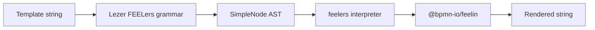
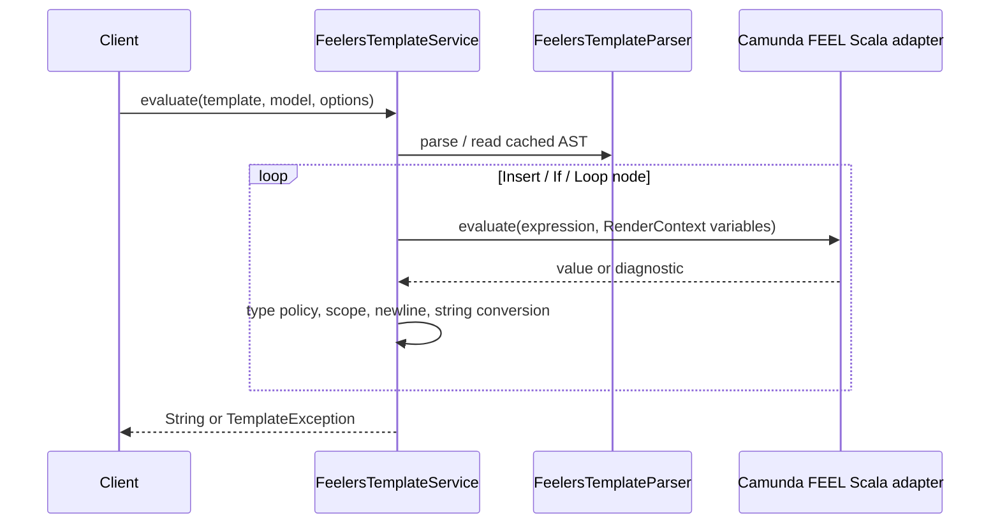

# FEELers Java Backend Design

Chinese: [feelers-java-backend-design.md](feelers-java-backend-design.md)

> Status: current implementation; aligned with the Camunda 8 dual-engine architecture
> Owner: backend templating module
> Last updated: 2026-08-09

## 1. Goals and boundaries

The goal is to render the same template syntax as front-end [`feelers`](https://www.npmjs.com/package/feelers) on Java servers, while separating **template syntax** from **FEEL expression evaluation**. Front-end `feelers` does not implement FEEL itself: it parses templates with Lezer and delegates evaluation to `@bpmn-io/feelin`. Java must therefore not implement a full FEEL interpreter by hand.

This design uses the **Camunda 8 dual-engine combination**: the browser uses `feelin`, Camunda's JavaScript FEEL engine for Forms and templating; the server uses Camunda's Java FEEL Scala Engine, Maven artifact `org.camunda.feel:feel-engine`. Camunda documents both engines for their respective environments and states that `feelin` does not support Camunda extensions. See [Camunda FEEL engine documentation](https://docs.camunda.io/docs/components/modeler/feel/what-is-feel/).

The shared contract is not one binary package. It is **one template-shell syntax, a versioned FEEL subset supported by both engines, and one compatibility test-vector set**. This is the practical boundary for “what users see is what the server sends” across browser and JVM.

Out of scope for this phase: DMN decision-table execution, arbitrary Java method calls, dynamically loaded user scripts, and binary interchange of front-end Lezer ASTs.

## 2. Front-end FEELers design

The front end has three layers:



### 2.1 Syntax layer

`@bpmn-io/lezer-feelers` recognizes the template shell only:

| Template construct | AST / behavior |
| --- | --- |
| Plain text | `SimpleTextBlock`, emitted unchanged |
| `= expression` | top-level `Feel`, rendered as one expression |
| `{{ expression }}` or `{{= expression }}` | `Insert` |
| `{{}}` / `{{=}}` | `EmptyInsert`, emits an empty string |
| `{{#if condition}}…{{/if}}` | `ConditionalSpanner` |
| `{{#loop collection}}…{{/loop}}` | `LoopSpanner` |

FEEL is not parsed by the template grammar; it is parsed by `feelin`. The template parser must preserve expression source, boundaries, and line positions. Nested blocks must not be replaced with regular expressions.

### 2.2 Interpreter layer

`feelers/lib/interpreter.js` applies these rules:

1. Insertions and top-level expressions are rewritten to `string(<expression>)`; a `sanitizer` may then process each result.
2. An `if` condition is evaluated as FEEL. With `strict=true`, it must evaluate to a boolean; otherwise JavaScript truthiness controls rendering.
3. A `loop` treats `null`/`undefined` as an empty array and wraps a scalar in a single-item array by default; strict mode rejects non-arrays.
4. A child loop context exposes `this`, `parent`, `_this_`, and `_parent_`; object fields are promoted into the child scope.
5. If a closing block tag includes a newline and the body does not end with one, the interpreter adds one.
6. With `debug=true`, errors become inline strings; otherwise they are thrown.

## 3. Back-end choice and shared language boundary

| Option | Decision | Reason |
| --- | --- | --- |
| Camunda FEEL Scala `org.camunda.feel:feel-engine` | **Recommended** | Camunda 8's Java FEEL engine for backend, BPMN, and DMN usage. See [Camunda expressions](https://docs.camunda.io/docs/components/concepts/expressions/) and the [Maven artifact](https://central.sonatype.com/artifact/org.camunda.feel/feel-engine). |
| Drools/KIE `kie-dmn-feel` | Not used | It would create a third semantic implementation, contrary to the Camunda 8 single-language goal. |
| Hand-written `ExpressionParser` | Prototype only | It cannot correctly cover dates, ranges, filters, quantifiers, functions, null semantics, and standard FEEL names. |

The backend dependency version must be centralized in the parent POM with `camunda.feel.version` and aligned with the target Camunda 8 cluster/distribution. Camunda notes that the Playground FEEL Scala version can differ from the cluster version, so the exact test baseline must be recorded. See [FEEL Playground version notes](https://docs.camunda.io/docs/components/modeler/feel/feel-playground/). Engine APIs must not leak through the public template API.

### 3.1 Allowed FEEL profile

The default profile is `camunda-feelers-core-v1`: variables and paths, strings/numbers/booleans/null, lists and contexts, comparison/arithmetic/logical operators, `if then else`, built-in functions available on both sides, and ISO-8601 date-time values. Camunda FEEL Scala-specific extensions are prohibited until `feelin` supports them and shared tests prove compatibility. Every stored template or API response carries the profile version; upgrades add a new profile instead of silently changing old template semantics.

## 4. Modules and API

The module is named `feelers-java`; the Spring-style implementation package is `com.tech.feelers.templating.service`. `FeelersTemplateService` is the current public entry point and aligns with the three front-end `feelers` methods:

```java
public final class FeelersTemplateService {
  public static String evaluate(String template, Map<String, Object> model);
  public static String evaluate(String template, Map<String, Object> model, RenderOptions options);
  public static FeelersTemplateNode parse(String template);
  public static FeelersTemplateNode parseToSimpleTree(String template);
}
```

Front-end `parse` returns a raw Lezer tree and `parseToSimpleTree` returns a simplified tree. Java has no Lezer layer: `FeelersTemplateParser` constructs `FeelersTemplateNode` directly, so both Java methods return `FeelersTemplateNode`. Java throws `TemplateException` for invalid template structure; the front end reports Lezer Tree error nodes. The shared boundary is the template shell, not the FEEL expression inside a tag.

`FeelExpressionEngine` is an internal extension point, not a caller entry point:

```java
public interface FeelExpressionEngine {
  Object evaluate(String expression, Map<String, Object> variables);
}

@Value
@Accessors(fluent = true)
public class RenderOptions {
  private final boolean strict;
  private final boolean debug;
  private final UnaryOperator<String> sanitizer;
}
```

The current implementation is organized as follows:

```text
feelers-java/
  engine/              FeelExpressionEngine, CamundaFeelExpressionEngine
  exception/           TemplateException
  entity/              BlockResult
  parser/              FeelersTemplateParser
    feelers/           Directive strategies
      context/          ParseContext, FeelersTemplateParseContext, RenderContext
      nodes/            FeelersTemplateNode, AST nodes, RenderOptions
  service/             FeelersTemplateService, FeelEvaluatorService
```

`FeelersTemplateParser` is in the root `parser` package and scans templates while selecting strategies. The `parser.feelers` package contains directive strategies; its `context` subpackage holds recursive parsing and rendering contexts, while its `nodes` subpackage contains `FeelersTemplateNode`, `TextNode`, `InsertNode`, `BlockNode`, `IfNode`, `LoopNode`, `TopLevelFeelNode`, and `RenderOptions`. Each node is in its own file with its own `render(FeelExpressionEngine, RenderContext, RenderOptions)` method. Nodes retain expression offsets for diagnostics.

## 5. Evaluation flow



1. Parse the complete template and validate matching block tags before evaluation; syntax errors fail the entire template.
2. The root `RenderContext` promotes model keys to variables and adds `this`/`_this_` for the root model and `parent`/`_parent_` as `null`.
3. `Insert` calls `FeelExpressionEngine`, converts the result with FEEL `string()`, then calls the sanitizer. The sanitizer is an output-encoding hook, not a FEEL security mechanism.
4. In strict mode, `If` accepts only `Boolean`. In non-strict mode, `false` and `null` are false and other values are true; shared front-end tests must verify this rule.
5. `Loop` creates a child context for `Collection`, Java arrays, and list values. Map fields become top-level child variables. Non-strict mode reproduces front-end null/scalar behavior.
6. Node failures become `TemplateException` with expression, node type, and source position. Debug mode produces the same placeholder form as the front end.

## 6. Front-end/back-end compatibility contract

Camunda 8 uses feelin on the front end and FEEL Scala on the back end. They are not the same runtime, and feelin lacks Camunda extensions. “Both are Camunda FEEL” therefore does not guarantee identical template rendering. The following behaviors are explicit contract tests:

| Area | Contract |
| --- | --- |
| Names | Support `this`, `parent`, `_this_`, `_parent_`, and promoted object fields |
| Insertion | Convert results to strings; empty insertion emits an empty string |
| Numbers | Avoid unexpected Java `1.0`, scientific notation, or localized formatting |
| Nulls | Cover missing variables, `null`, list nulls, and conditional behavior |
| Collections | In non-strict mode null means no iterations and a scalar means one; strict mode fails |
| Date/time | Use ISO-8601; pass time zone explicitly with `Clock`/`ZoneId` |
| Newlines | Reproduce the newline behavior of `{{#if/loop …}}` and closing tags |
| Errors | Throw by default; debug uses `{{ feel expression … couldn't be evaluated }}` |
| Security | Prevent reflection, class loading, and arbitrary Java methods; allow only a FEEL function allowlist |

Shared tests belong in `test-vectors/feelers-render-cases.json`. Each case contains `id`, `profile`, `template`, `context`, `options`, and either `expected` or `error`. Jest (`feelers` + `feelin`) and JUnit (template parser + Camunda FEEL Scala) must read the same data. The existing `templating-syntax/js-templating-syntax.test.js` is the initial scenario list. When Camunda 8, FEEL Scala, feelin, or feelers is upgraded, CI must run both suites and report differences; any difference blocks release.

### 6.1 Goal coverage check

| Goal | Design coverage | Verification | Remaining implementation |
| --- | --- | --- | --- |
| 1. Both sides use FEEL and Camunda libraries | **Covered**: front end uses `feelin`, backend uses `feel-engine`, with one `camunda-feelers-core-v1` profile | Dependency lock and profile vectors | Align with the actual target Camunda 8 version |
| 2. Backend follows the front-end template design | **Covered**: front-end parser → AST → interpreter → FEEL engine maps to Java `parser/`, `service/`, and `engine/` | Nested blocks, source offsets, newlines, and error cases | Expand source locations from offsets to line/column |
| 3. Keep tests aligned | **Covered by direction**: JSON vectors are the intended single test source | CI compares both results and error codes | Migrate Jest cases to JSON and add parameterized JUnit tests |
| 4. One expression language for Camunda 8 surrounding systems | **Covered**: fixed template shell and FEEL profile prevent one-sided extensions | Template API profile validation and release gate | Add profile registry, migration, and deprecation processes |

## 7. Dependencies, performance, and security

**Dependencies.** Business POMs depend on this module only; this module internally uses Camunda `org.camunda.feel:feel-engine`. Engine-specific classes belong only in the `engine/` adapter package. Avoid adding complete BPMN, DMN, or rules-engine dependencies.

**Caching.** Cache immutable template ASTs. Whether expressions can be cached is declared by `FeelExpressionEngine`. Cache keys include at least template/expression source, engine version, function profile, and time-zone profile. Caches must never contain request contexts or rendered output.

**Resource limits.** Limit template bytes, AST depth, nested loop depth, items per loop, total rendered characters, and expression execution time. Reject excessively deep recursion, huge lists, and unbounded custom functions.

**Observability.** Record template ID, duration, cache hit, node count, and controlled error code. Do not log complete models or rendered content by default.

## 8. Delivery plan and acceptance

1. Run an isolated POC against the FEEL Scala version matching the target Camunda 8 cluster: variables, `string()`, Map/JavaBean values, collections, dates, error diagnostics, and custom functions.
2. Maintain the template AST parser and evaluator without changing the public FEELers-aligned API.
3. Keep the `FeelExpressionEngine` SPI and Camunda adapter behind the template API, with dependency-isolation tests.
4. Move current Jest cases into JSON test vectors and execute the same vectors through parameterized JUnit tests; initially allow only `camunda-feelers-core-v1`.
5. Add 40+ boundary cases for nulls, nested blocks, string escaping, dates, ranges, error locations, and security constraints.
6. Release the implementation only after all front-end/back-end vectors pass.

Acceptance requires 100% template-structure coverage, shared vectors passing in both Jest and JUnit, matching strict/debug/newline behavior, no template-triggered reflection or arbitrary Java method calls, and performance/resource limits that meet the service SLO.
