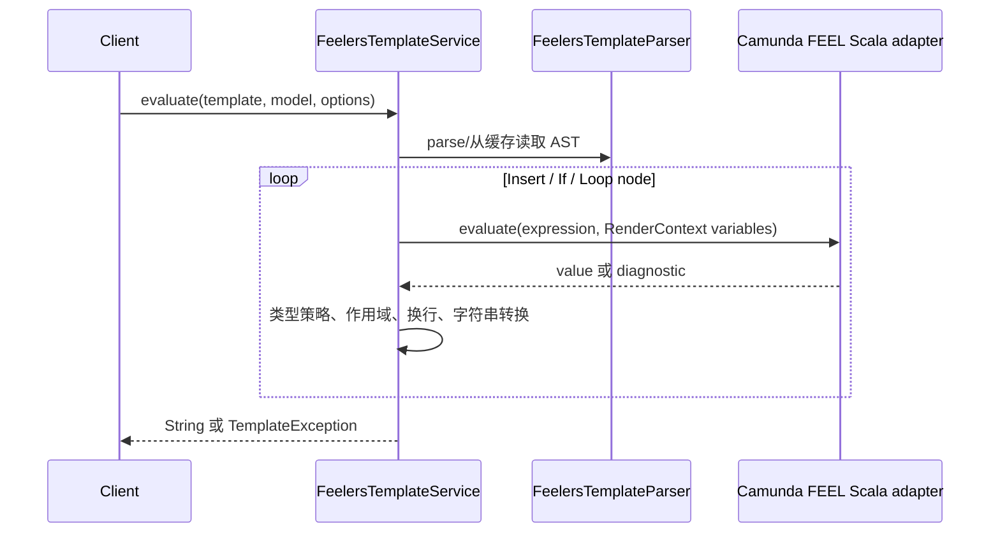

# FEELers Java 后端设计

English: [feelers-java-backend-design.en.md](feelers-java-backend-design.en.md)

> 状态：当前实现；已按 Camunda 8 双引擎架构校准
> 负责人：后端模板模块
> 最后更新：2026-08-09

## 1. 目标与边界

目标是在 Java 服务端渲染与前端 [`feelers`](https://www.npmjs.com/package/feelers) 相同的模板语法，并把 **模板语法** 与 **FEEL 表达式求值** 明确分层。前端的 `feelers` 不自行实现 FEEL：它用 Lezer 解析模板，再委托 `@bpmn-io/feelin` 求值。因此 Java 端也不应手写完整 FEEL 解释器。

本方案统一采用 **Camunda 8 的双引擎组合**：浏览器端使用 Camunda 文档定义、并用于 Forms 与 templating 的 JavaScript FEEL 引擎 `feelin`；服务端使用 Camunda 的 Java FEEL Scala Engine（Maven 坐标 `org.camunda.feel:feel-engine`）。Camunda 明确说明这两个引擎面向不同使用场景，二者都支持基础 FEEL 语法和函数；同时也明确指出 `feelin` 不支持 Camunda 扩展。[Camunda FEEL 引擎说明](https://docs.camunda.io/docs/components/modeler/feel/what-is-feel/)

因此，统一的不是“同一个二进制包”，而是 **同一套模板外壳语法 + 受版本锁定的、两个引擎共同支持的 FEEL 子集 + 同一份兼容测试向量**。这是在浏览器和 JVM 之间实现用户所见即服务端所发的可行边界。

不在本阶段实现：DMN 决策表执行、任意 Java 方法调用、动态加载用户脚本，以及前端 Lezer AST 的二进制互传。

## 2. 前端 FEELers 的设计分析

前端由三层组成：


### 2.1 语法层

`@bpmn-io/lezer-feelers` 只识别模板外壳：

| 模板结构 | AST/行为 |
| --- | --- |
| 普通文本 | `SimpleTextBlock`，原样输出 |
| `= expression` | 顶层 `Feel`，作为一个表达式渲染 |
| `{{ expression }}` 或 `{{= expression }}` | `Insert` |
| `{{}}` / `{{=}}` | `EmptyInsert`，输出空串 |
| `{{#if condition}}…{{/if}}` | `ConditionalSpanner` |
| `{{#loop collection}}…{{/loop}}` | `LoopSpanner` |

FEEL 本身不是由模板 grammar 解析，而由 `feelin` 的 FEEL parser 解析。因此模板解析器必须保留表达式原文、边界和行号，不能尝试用正则直接替换嵌套区块。

### 2.2 解释层

`feelers/lib/interpreter.js` 的关键规则如下：

1. 插值与顶层表达式会被改写为 `string(<expression>)`；随后可对每一个结果调用 `sanitizer`。
2. `if` 的条件直接执行 FEEL。`strict=true` 时，结果必须是布尔值；默认模式按 JS truthy 规则决定是否渲染。
3. `loop` 默认将 `null`/`undefined` 当空数组，将单个值包装成单元素数组；`strict=true` 时非数组报错。
4. 循环子上下文注入 `this`、`parent`，以及兼容别名 `_this_`、`_parent_`；若循环项是对象，其字段会提升到当前作用域。
5. 关闭块标签若带换行，且内部结果没有以换行结束，解释器补一个换行。这是与一般 Mustache 实现不同的兼容点。
6. `debug=true` 时错误转成内联字符串；否则抛出错误。

## 3. 后端选型与统一语言边界

| 方案 | 结论 | 原因 |
| --- | --- | --- |
| Camunda FEEL Scala `org.camunda.feel:feel-engine` | **推荐** | Camunda 8 在后端/BPMN/DMN 使用的 Java FEEL 引擎；通过 Java API builder 使用。[Camunda 8 表达式说明](https://docs.camunda.io/docs/components/concepts/expressions/)；[Maven 制品](https://central.sonatype.com/artifact/org.camunda.feel/feel-engine) |
| Drools/KIE `kie-dmn-feel` | 不采用 | 虽是成熟 JVM FEEL 引擎，但会形成第三套语义，不符合本系统围绕 Camunda 8 统一表达式语言的目标 |
| 当前手写 `ExpressionParser` | 仅保留为教学/原型 | 无法完整覆盖日期、范围、过滤、量词、函数、空值语义及标准 FEEL 名称 |

后端依赖版本不应在业务模块中散落：在父 POM 使用 `camunda.feel.version` 属性锁定 `feel-engine`，并与目标 Camunda 8 集群/发行版本对齐。Camunda 也提示 Playground 所用 FEEL Scala 版本可能不同于集群版本，因此测试基线必须记录确切版本。[Camunda FEEL Playground 版本说明](https://docs.camunda.io/docs/components/modeler/feel/feel-playground/)。引擎 API 不应泄露到模板模块的公共接口。

### 3.1 允许的 FEEL Profile

默认 Profile 为 `camunda-feelers-core-v1`：变量与路径、字符串/数值/布尔/null、列表与 context、比较/算术/逻辑、`if then else`、前后端均有的内置函数，以及 ISO-8601 日期时间。禁止使用 Camunda FEEL Scala 专有扩展，直到 `feelin` 也支持且共享用例证明一致。每个模板存储或接口响应都携带该 profile 的版本，升级只能新增 profile，不能静默改变旧模板的解释。

## 4. 推荐模块与 API

模块命名为 `feelers-java`，Spring 风格实现包名为 `com.tech.feelers.templating.service`。当前公共入口为 `FeelersTemplateService`，并对齐前端 `feelers` 的三个方法：

```java
public final class FeelersTemplateService {
  public static String evaluate(String template, Map<String, Object> model);
  public static String evaluate(String template, Map<String, Object> model, RenderOptions options);
  public static FeelersTemplateNode parse(String template);
  public static FeelersTemplateNode parseToSimpleTree(String template);
}
```

前端 `parse` 返回 Lezer 原始语法树、`parseToSimpleTree` 返回简化树；Java 没有 Lezer 层，`FeelersTemplateParser` 直接构建 `FeelersTemplateNode`，所以两个 Java 方法均返回 `FeelersTemplateNode`。Java 在模板结构不合法时抛出 `TemplateException`，前端则通过 Lezer Tree 的错误节点报告问题。两端的共同边界均为模板外壳语法，不校验标签内部的 FEEL 表达式。

FEEL 引擎接口保持内部扩展点，不作为模板调用方的入口：

```java
public interface FeelExpressionEngine {
  Object evaluate(String expression, Map<String, Object> variables);
}

@Value
@Accessors(fluent = true)
public class RenderOptions {
  private final boolean strict;
  private final boolean debug;
  private final UnaryOperator<String> sanitizer;
}
```

当前内部实现按以下分层组织：

```text
feelers-java/
  engine/              FeelExpressionEngine、CamundaFeelExpressionEngine
  exception/           TemplateException
  entity/              BlockResult
  parser/              FeelersTemplateParser
    feelers/           指令策略
      context/          ParseContext、FeelersTemplateParseContext、RenderContext
      nodes/            FeelersTemplateNode、AST 节点、RenderOptions
  service/             FeelersTemplateService、FeelEvaluatorService
```

`FeelersTemplateParser` 位于 `parser` 根包，负责模板扫描和策略选择。`parser.feelers` 包包含指令策略；其 `context` 子包保存递归解析和渲染所需上下文，`nodes` 子包包含 `FeelersTemplateNode`、`TextNode`、`InsertNode`、`BlockNode`、`IfNode`、`LoopNode`、`TopLevelFeelNode` 和 `RenderOptions`。每个节点使用独立文件并拥有自己的 `render(FeelExpressionEngine, RenderContext, RenderOptions)` 方法。节点保留表达式偏移量，以便错误定位。

## 5. 渲染流程



1. 先解析整个模板并验证块标签配对；语法错误立即报错，不执行部分模板。
2. 根 `RenderContext` 将模型的键作为变量，另注入 `this`/`_this_` 为根模型、`parent`/`_parent_` 为 `null`。
3. `InsertNode` 调用 `FeelExpressionEngine`，将结果按 FEEL `string()` 语义格式化后再调用 sanitizer。sanitizer 是输出编码钩子，不是 FEEL 安全机制。
4. `IfNode` 仅接受 `Boolean`（strict）；非 strict 采用明确的兼容规则：`false`、`null` 为空，其他值为真。该规则必须通过前端对照测试确认，而不是沿用 Java 的任意 truthy 猜测。
5. `LoopNode` 对 `Collection`、Java array、KIE list 逐项建立 child context；对象项的 Map 字段或 JavaBean 可读属性可投影为顶层变量。非 strict 模式复刻前端的空/单值规则。
6. 任何节点的异常都转换成 `TemplateException`（含表达式、节点类型与 `SourceSpan`）；debug 模式通过 `DebugStringBuilder` 输出与前端相同的占位符。

## 6. 前后端兼容契约

Camunda 8 本身在前端使用 feelin、后端使用 FEEL Scala；两者并非同一个运行时，且 feelin 没有 Camunda 扩展。因此“同为 Camunda FEEL”不自动等于“模板渲染完全一致”。以下行为必须作为显式契约测试：

| 领域 | 契约 |
| --- | --- |
| 名称 | 支持 `this`、`parent`、`_this_`、`_parent_` 与对象字段提升 |
| 插值 | 结果统一转换为字符串；空插值输出空串 |
| 数字 | 不出现 Java `1.0`、科学计数法或本地化格式意外差异 |
| 空值 | 缺失变量、`null`、列表中的 `null` 的输出和条件语义均有用例 |
| 集合 | 非 strict 下 `null` 为空循环、单值为一次循环；strict 下报错 |
| 日期/时间 | 统一用 ISO-8601；时区由 `Clock`/`ZoneId` 显式传入 |
| 换行 | 复现 `{{#if/loop …}}` 与闭合标签的吞吐换行规则 |
| 错误 | 默认抛异常；debug 使用 `{{ feel expression … couldn't be evaluated }}` 格式 |
| 安全 | 禁止从模板访问反射、类加载、任意 Java 方法；只注册白名单 FEEL 函数 |

共享测试源应放在 `test-vectors/feelers-render-cases.json`，每条包含 `id`、`profile`、`template`、`context`、`options`、`expected` 或 `error`。Jest（`feelers` + `feelin`）与 JUnit（模板 parser + Camunda FEEL Scala）必须同时读取这一份数据；当前的 `frontend/test/js-templating-syntax.test.js` 是其初始场景清单。对 Camunda 8、FEEL Scala、feelin 或 feelers 升级，CI 必须同时运行两套测试并报告差异，任何差异阻止发布。

## 6.1 设计目标覆盖核验

| 目标 | 设计覆盖 | 验证方式 | 尚未完成的实施项 |
| --- | --- | --- | --- |
| 1. 两端源于 FEEL，并采用 Camunda 库 | **覆盖**：前端 `feelin`，后端 `feel-engine`；统一 `camunda-feelers-core-v1` Profile | 依赖锁定与 FEEL Profile 向量 | 接入 Camunda adapter、锁定实际 Camunda 8 版本 |
| 2. 后端参考前端设计解析模板 | **覆盖**：前端的 parser → AST → interpreter → FEEL engine 四层映射为 Java `parser/`、`service/`、`engine/` | 嵌套块、源位置、换行与错误用例 | 将偏移量扩展为行/列信息 |
| 3. 两端测试尽量一致 | **覆盖**：JSON 向量为唯一测试源，Jest/JUnit 同时读取 | CI 对比结果与错误码 | 将当前 13 个 Jest 用例迁移为 JSON，补 JUnit 参数化测试 |
| 4. Camunda 8 外围系统的一套表达式语言 | **覆盖**：固定模板外壳和 FEEL Profile，禁止单端/专有扩展进入该 Profile | 模板 API 校验 profile，发布门禁 | 建立 profile 注册表、迁移与弃用流程 |

## 7. 依赖、性能与安全

**依赖。** 业务 POM 仅依赖本模块；本模块内部引入 Camunda `org.camunda.feel:feel-engine`。引擎特有类只允许出现在 `engine/` adapter 包，避免把完整 BPMN、DMN 或规则引擎带入。

**缓存。** 缓存不可变模板 AST；表达式是否可缓存由 `FeelExpressionEngine` 能力声明。缓存键至少包括模板/表达式文本、引擎版本、函数集 profile 与时区 profile。缓存禁止包含请求上下文或渲染结果。

**资源限制。** 限制模板字节数、AST 深度、嵌套循环深度、单循环项数、总渲染字符数和表达式执行时间。拒绝递归过深、超大列表与未受限用户自定义函数。

**可观测性。** 记录模板 ID、耗时、缓存命中、节点数和受控错误码；默认不记录完整模型或渲染结果，以免泄漏数据。

## 8. 落地计划与验收

1. 用与目标 Camunda 8 集群匹配的 FEEL Scala 版本做隔离 POC：变量、`string()`、Map/JavaBean、集合、日期、错误诊断及自定义函数。
2. 实现模板 AST parser 与 renderer，不改动现有 Java 原型的公开入口。
3. 新增 `FeelExpressionEngine` SPI 和 Camunda adapter；通过依赖隔离测试确保 API 不泄露 Camunda/Scala 类型。
4. 将现有 Jest 的 13 个用例迁移为 JSON 测试向量，JUnit 参数化执行同一批向量；先只允许 `camunda-feelers-core-v1` Profile。
5. 补齐 40+ 边界用例（空值、嵌套块、字符串转义、日期、范围、错误位置、安全限制）。
6. 仅当前后端向量全部通过后，将生产实现切换到 Camunda adapter。

验收标准：模板结构 100% 覆盖；共享向量在 Jest 与 JUnit 均通过；strict/debug/换行行为一致；无模板可触发任意 Java 反射或方法调用；性能基准与资源限制满足服务 SLO。
