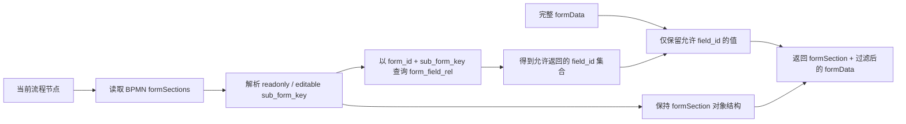

# Subform Filter 设计（草案）

> 状态：草案，范围仅限后端向前端返回当前流程节点可见的子表单字段和值
>
> 最后更新：2026-08-18

## 1. 背景

一个前端 `Form` 由多个 `Subform` 组成；每个 `Subform` 有多个 `FormItem`，每个 `FormItem` 绑定一个
字段（`Field`）：

```text
Form
 ├─ Subform A
 │   ├─ FormItem1 → Field 1
 │   └─ FormItem2 → Field 2
 └─ Subform B
     ├─ FormItem3 → Field 3
     └─ FormItem4 → Field 4
```

后端字段与表单、子表单的归属由 `form_field_rel` 维护。本文以以下字段为该关系的最小契约：

| 字段 | 含义 |
| --- | --- |
| `form_id` | 表单标识。 |
| `field_id` | 字段标识。 |
| `sub_form_key` | 字段所属子表单的稳定标识。 |

同一 `(form_id, sub_form_key)` 对应一组可返回的 `field_id`。`sub_form_key` 是后端查询与 BPMN 配置的
唯一连接键；前端的 `Subform` 必须使用同一稳定标识，不能以展示名称或组件位置匹配。

在 BPMN 的每个 `userTask` 和 `startEvent` 上，Extension Properties 可配置 `formSections`，指定当前节点
哪些子表单展示为只读、哪些展示为可编辑。例如：

```json
{
  "readonly": ["subform-a"],
  "editable": ["subform-b"]
}
```

## 2. 目标

本设计的目标是：当流程进入某个节点时，后端基于该节点的 `formSections` 及 `form_field_rel`，从完整
`formData` 中筛选出当前节点允许前端读取的字段和值，同时返回各子表单的展示模式。

目标：

- 后端成为字段可见范围的权威来源，前端不依赖本地规则推断或自行扩展可读字段；
- `readonly` 和 `editable` 子表单均返回其所属字段和值，但以不同模式标识；
- 未配置到当前节点的子表单及其字段不返回；
- 查询仅以 `form_id`、`sub_form_key` 和 `field_id` 关联，不耦合前端组件结构；
- 配置错误、关系错误和数据错误有稳定、不会泄露隐藏字段内容的错误语义。

## 3. 运行时输入与输出

Filter Service 的公共输入固定为：

| 输入 | 来源 | 用途 |
| --- | --- | --- |
| `formId` | 当前流程实例/业务记录 | 限定字段关系及表单数据所属表单。 |
| `nodeId` | 当前 BPMN `startEvent` 或 `userTask` | 定位并读取该节点的 `formSections` 配置。 |
| 原始 `formData` | 后端已加载的完整表单数据 | 筛选字段值；不得直接由客户端提供后作为读取权威数据。 |

服务输出固定包含 `formId`、`nodeId`、过滤后的 `formData` 和 BPMN 原样结构的 `formSection` 对象。`formData`
以 `field_id` 为键时，实际传输对象若已有统一字段值格式，可保持其现有包装，但筛选语义必须等价。

```json
{
  "formId": "expense-form",
  "nodeId": "reviewTask",
  "formSection": {
    "readonly": ["subform-a"],
    "editable": ["subform-b"]
  },
  "formData": {
    "field-1": "travel",
    "field-2": 1200,
    "field-3": "approved"
  }
}
```

`formSection.readonly` 与 `formSection.editable` 保持 BPMN 配置中的数组顺序和分组，不进行重排或改写。
输出 `formData` 中只能包含这两个数组对应的 `field_id`；不存在或值为 `null` 的可见字段是否显式返回，沿用原始 `formData` 的
序列化约定，不能因本过滤器改变其值语义。

## 4. 过滤流程



具体步骤：

1. 根据当前流程定义版本和 `nodeId` 找到 `startEvent` 或 `userTask`，读取其 Extension Properties 中的
   `formSections`。
2. 解析 `readonly` 和 `editable` 两个数组。缺失的数组按空数组处理；`formSections` 缺失时，返回
   `{ "readonly": [], "editable": [] }` 作为 `formSection`，且过滤后的 `formData` 为空。
3. 验证两个数组都仅包含非空字符串，并确保同一个 `sub_form_key` 不会同时或重复出现。
4. 将 BPMN 配置标准化为 `formSection` 对象，结构始终为 `{ "readonly": [], "editable": [] }`；两个数组
   中的 key 及其顺序保持不变。合并两个数组得到本节点允许展示的 `sub_form_key` 集合。
5. 使用 `formId` 与该 `sub_form_key` 集合查询字段关系表（`form_field_rel`），取得允许返回的
   `field_id` 列表。
6. 用该 `field_id` 列表过滤原始 `formData`，仅复制匹配字段的值，保留值本身的 JSON 语义。
7. 返回 `formId`、`nodeId`、组装后的 `formSection` 和过滤后的 `formData`。不属于当前可见 key 的字段
   不得出现在输出中。

本流程不通过“前端传入想要的字段列表”来决定返回范围，也不使用字段名称、FormItem ID 或 UI 层级来
替代 `form_field_rel` 查询。

## 5. `formSections` 与关系表契约

`formSections` 中的 ID 必须是 `sub_form_key`，即必须可与当前 `form_id` 下的 `form_field_rel.sub_form_key`
精确匹配。为避免将配置问题隐藏成空界面，服务端需在模型发布期及运行时执行以下检查：

| 情况 | 处理 |
| --- | --- |
| `readonly` 或 `editable` 不是字符串数组 | BPMN 配置错误。 |
| 同一个 key 在两组中同时出现 | BPMN 配置错误；不能按任意优先级覆盖。 |
| 数组中同一个 key 重复 | BPMN 配置错误。 |
| key 在当前 `formId` 下没有任何 `form_field_rel` | BPMN/表单关系配置错误。 |
| 同一 `(form_id, field_id)` 映射到多个不同 `sub_form_key` | 表单关系配置错误；v1 不支持同一字段跨子表单返回。 |
| 关系表返回的字段在 `formData` 中无值 | 不报错；按既有数据序列化规则表示缺失或 `null`。 |

过滤器不为未映射字段猜测子表单，也不把“没有关系记录”解释为根表单字段。若未来需要返回根表单字段，
应由独立的根字段范围契约处理。

## 6. 安全与数据边界

- 后端必须在加载 `formData` 前完成业务记录、流程实例、租户和调用者权限校验；本过滤器不取代授权。
- 过滤后的响应是最小字段集合：隐藏子表单字段、其他节点字段及不属于当前 `formId` 的字段均不得返回。
- 查询 `form_field_rel` 时必须带 `form_id` 条件，不能仅凭 BPMN 中的 `sub_form_key` 跨表单查询。
- BPMN 配置只能来自已发布流程定义，客户端不得在读取请求中传入、覆盖或追加 `formSections`。
- 日志可记录 `formId`、流程定义/节点版本、可见 key 数量、字段数量和错误码；不得记录隐藏字段值或完整
  `formData`。

## 7. 错误契约

错误响应不包含隐藏字段 ID、完整 BPMN 属性、完整关系记录或表单值。

| code | 建议 HTTP 状态 | 含义 |
| --- | --- | --- |
| `form.sectionConfigurationInvalid` | 500 | `formSections` 结构无效、key 重复或 readonly/editable 重叠。 |
| `form.sectionMappingMissing` | 500 | BPMN 指定的 `sub_form_key` 在该 `formId` 下没有字段映射。 |
| `form.fieldMappingAmbiguous` | 500 | 一个字段被映射到多个子表单，无法确定安全返回范围。 |
| `form.nodeNotFound` | 409 | 当前流程节点与已发布流程定义不匹配。 |
| `forbidden.formData` | 403 | 调用方无权读取该流程或表单数据。 |
| `form.dataUnavailable` | 404 | 指定的表单数据不存在或不属于该流程实例。 |

部署或配置错误不能退化为空的 `formData` 响应，因为这会掩盖流程配置问题并让前端误认为没有数据。

## 8. 验收标准

- 给定同一 `formId`、节点配置、关系表和原始 `formData`，响应只含 `readonly` 与 `editable` 对应子表单的
  字段值，并原样返回 `formId`、`nodeId`。
- `readonly` 与 `editable` 子表单分别保留在 `formSection.readonly`、`formSection.editable` 中，前端由其
  所在数组明确得到模式。
- 未列在 `formSections` 的子表单字段绝不出现在过滤后的 `formData` 中，即使这些值存在于原始 `formData`。
- `sub_form_key` 与 `form_field_rel` 不匹配、key 重复/重叠、字段归属歧义时，服务端返回稳定配置错误而不
  返回部分数据。
- 关系查询始终以 `form_id` 限定，不能因不同表单复用相同 `sub_form_key` 泄露字段。
- 读取接口不定义提交数据的写权限或字段值校验；该能力将在 JSON validation 设计中单独处理。
