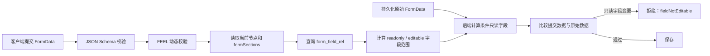

# FormData 写权限与防篡改校验设计（草案）

> 状态：草案
>
> 范围：后端接收 FormData 提交时，对只读字段的篡改进行校验
>
> 最后更新：2026-08-19

## 1. 背景与关联设计

本设计建立在以下两个设计之上：

- [Subform Filter 设计](3-subform-filter-design.md)：流程到达某个 `startEvent` 或 `userTask` 时，后端读取
  BPMN Extension Properties 的 `formSections`，以 `formId` 和 `sub_form_key` 查询 `form_field_rel`，过滤
  出可以返回给前端的 `formData`。
- [JSON Schema 与 FEEL 动态校验设计](1-json-schema-validation-design.md)：后端对提交后的完整 FormData 执行
  JSON Schema 静态校验及 FEEL 动态校验。

`form_field_rel` 至少包含 `form_id`、`field_id`、`sub_form_key` 和 `rules`。其中 `rules` 存储字段在前端
定义的条件控制规则。BPMN 节点中的 `formSections` 结构为：

```json
{
  "readonly": ["subform-a"],
  "editable": ["subform-b"]
}
```

Subform Filter 解决“后端向前端返回什么字段”。本设计解决“后端接收前端提交时，哪些字段允许发生变化”。
两者必须使用同一流程定义版本、当前节点、`formId` 和 `form_field_rel`，避免读写范围不一致。

## 2. 目标

- 拒绝客户端对只读字段的新增、修改、清空或删除；
- 同时覆盖 BPMN 配置的只读子表单，以及可编辑子表单中因业务条件而变为只读的字段；
- 由后端独立计算字段是否可写，不信任客户端传来的只读状态、组件属性或字段列表；
- 先校验提交的新值是否满足 JSON Schema 与 FEEL 规则；校验失败时不查询原始 FormData，也不执行 diff；
- 仅对值校验通过的提交数据查询原始 FormData 并做写权限及防篡改校验。

## 3. 两类只读字段

### 3.1 BPMN `readonly` 子表单字段

当前节点 `formSections.readonly` 中的每个 `sub_form_key`，通过 `form_field_rel` 映射得到其字段集合。该集合
中的所有字段均为只读。客户端即使在请求体中显式携带这些字段，也不得改变其持久化值。

### 3.2 `editable` 子表单中的条件只读字段

`formSections.editable` 只表示子表单在当前节点可编辑，并不保证其中每个字段都可写。前端可根据当前
FormData、流程变量或表单规则，将其中的某些字段显示为只读或隐藏。

字段级规则保存在当前字段的 `form_field_rel.rules` 中。例如，下面规则表示当表达式结果为 `true`（即
前端所称的 `Yes`）时，当前 `field_id` 为只读：

```json
{
  "mode": "Expression",
  "value": "{{ fieldX = \"Y\" }}",
  "ruleType": "READONLY"
}
```

`ruleType` 仅支持 `READONLY` 或 `HIDDEN`。两种规则在防篡改校验中的结论一致：当其表达式执行结果为
`true` 时，当前 `form_field_rel` 记录对应的 `field_id` 必须标记为只读，禁止新增、修改、清空或删除。
`HIDDEN` 的展示含义仍由前端处理；后端防篡改只关心它是否使当前字段不可写。

这类只读状态不能只存在于前端。后端必须使用与前端一致、已发布的字段可写性规则和相同运行上下文，
独立执行 `form_field_rel.rules` 并计算该字段当前是否只读。客户端提交的 `readonly`、`hidden` 标记、
FormItem 属性或“未修改”声明均不作为可信依据。

字段可写性规则需要至少返回以下确定结论：

| 结论 | 含义 |
| --- | --- |
| `editable` | 当前字段允许新增、修改、清空或删除。 |
| `readonly` | 当前字段必须与提交前持久化值完全一致。 |

规则所依赖的表单数据、流程变量、时钟与业务时区必须由服务端提供；日期/时间语义遵循 JSON Schema 与
FEEL 动态校验设计中已定义的 `clock` 契约。若后端无法执行某条前端条件只读规则，必须将其视为配置错误
并拒绝提交，不能默认放行。

## 4. 校验输入

写权限校验至少需要以下服务端可信输入：

| 输入 | 用途 |
| --- | --- |
| `formId` | 查询 `form_field_rel` 并绑定表单定义。 |
| 当前流程实例、流程定义版本和 `nodeId` | 读取当前节点的 BPMN `formSections`。 |
| 提交前持久化的完整 `formData` | 与客户端提交值比较，识别只读字段变更。 |
| 客户端提交的 FormData 或变更集 | 校验其实际修改内容。 |
| `form_field_rel.rules` 及其服务端上下文 | 判断 `editable` 子表单中的条件只读/隐藏字段。 |
| 调用方身份及授权范围 | 在读取和保存前完成资源级授权。 |

客户端传入的 `formId`、`nodeId` 仅用于定位请求；服务端必须从当前流程实例和业务记录重新确认二者，不能
信任其指向任意表单或节点。

## 5. 校验流程



1. 在完成基础身份、表单归属和流程节点访问权限检查后，先对客户端提交的 FormData 执行既有 JSON Schema
   与 FEEL 动态校验。任何值校验失败都直接返回，不查询提交前 FormData，也不执行防篡改 diff。
2. 值校验通过后，服务端从当前流程实例确定 `formId`、流程定义版本和 `nodeId`，读取当前 BPMN 节点的
   `formSections`，并取得提交前持久化的完整 `formData`。
3. 以 `formId` 及 `formSection.readonly`、`formSection.editable` 查询 `form_field_rel`，得到子表单字段范围。
4. 将 `readonly` 子表单的所有字段标记为只读；对 `editable` 子表单内的字段，使用其
   `form_field_rel.rules` 和服务端上下文执行 `READONLY`、`HIDDEN` 表达式。任一规则结果为 `true` 时，
   当前字段同样标记为只读。
5. 将已经通过值校验的提交数据与提交前完整 `formData` 比较。任一只读字段有新增、修改、清空或删除时，
   立即拒绝请求。
6. 防篡改校验通过后保存提交数据。并发控制、加锁及版本冲突处理属于具体代码实现设计，不在本文规定。

## 6. 变更判定

字段变更按 JSON 值比较，比较前应使用现有 FormData 持久化/反序列化的统一规范化规则。不得以字符串化、
JavaScript 宽松相等、Java 对象引用或前端展示格式比较。

| 原始状态 | 提交状态 | 只读字段结果 |
| --- | --- | --- |
| 有值 | 相同 JSON 值 | 允许。 |
| 有值 | 不同值、`null` 或缺失 | 拒绝。 |
| `null` 或缺失 | 相同状态 | 允许。 |
| `null` 或缺失 | 任意有值 | 拒绝。 |

数组和对象字段按其规范化后的完整 JSON 值比较；不可通过只提交对象的一部分来绕过只读字段校验。若接口
采用字段级变更集，服务端仍需验证变更集中每个 `field_id` 的可写性，且合并后结果必须遵循本节语义。

## 7. 错误契约

| code | 建议 HTTP 状态 | 含义 |
| --- | --- | --- |
| `form.fieldNotEditable` | 403 或 409 | 提交试图改变当前只读字段。 |
| `form.fieldWriteRuleInvalid` | 500 | `rules` 结构无效、表达式无法解析/执行，或结果不是 boolean。 |
| `form.sectionConfigurationInvalid` | 500 | 当前 BPMN `formSections` 无效或与 `form_field_rel` 不一致。 |
| `forbidden.formData` | 403 | 调用方无权访问该表单或流程实例。 |

`form.fieldNotEditable` 可返回稳定的字段标识或 JSON Pointer 供前端定位，但不得回显原始值、隐藏字段值、
内部表达式或完整可写性规则。

## 8. 验收标准

- `formSection.readonly` 关联的字段只要被新增、修改、清空或删除，服务端均拒绝提交。
- `formSection.editable` 内字段的 `form_field_rel.rules` 中，任一 `READONLY` 或 `HIDDEN` 表达式结果为 `true`
  时，具有与上述相同的防篡改效果。
- 仅由客户端标记为只读、但后端无法复现的规则，不能作为放行或拒绝的唯一依据；后端必须使用已发布规则。
- JSON Schema 与 FEEL 校验优先于原始 FormData 查询和防篡改 diff；值校验失败时不进入防篡改阶段。
- 同一节点、FormData 和规则上下文下，前端与后端对条件只读字段的结论一致；后端不能执行时明确失败。
