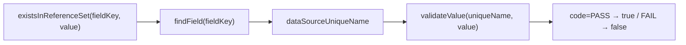

# Java 校验服务代码设计方案（草案）

> 状态：待评审
>
> 上游契约：[1-json-schema-validation-design.md](../1-json-schema-validation-design.md)
>
> 最后更新：2026-08-17

## 1. 范围与已确认前提

本方案落地两个服务：

- **FormValidationService**：校验主入口。Form DSL → JSON Schema 生成、JSON Schema 静态校验、
  `x-feel-assertions` 断言校验。
- **FeelExpressionEngine**：后端 FEEL 表达式库，镜像前端 `frontend/src/FeelExpressionEngine/`
  的分层，并新增 `existsInReferenceSet`。

已确认的决策：

| # | 决策 |
| --- | --- |
| 1 | 新增依赖 `networknt json-schema-validator`、`jackson-databind`、`slf4j-api` |
| 2 | 新建 `com.tech.feelers.expression` 包，与现有 `templating` 平级；不改动 `templating.engine` |
| 3 | 本轮不做 `bigDecimalCalc`；函数集为 `businessDay`、`calendarDay`、`existsInReferenceSet` |
| 4 | 参照数据走 mock API，两跳调用，**不加缓存**（数据量小、查询快） |

### 1.1 已验证的技术前提

用真实依赖跑通，结论直接影响设计：

| 验证项 | 结果 |
| --- | --- |
| `JavaFunctionProvider` + `withFunctionProvider` 注册自定义函数 | 可与 `withEnabledExternalFunctions(false)` 并存，满足 8.1 |
| 自定义函数读取上下文变量、返回 `ValBoolean`/`ValNumber` | 通过 |
| `parseExpression` 只解析不执行 | 通过，对应前端 `validate()` |
| camunda 十进制语义（`0.1 + 0.2 = 0.3`） | 返回 `true`，与前端原生 double 的 `false` 相反 |
| **调用未注册函数 `unknownFn(1)`** | **静默返回 `null`，不报错** |

最后一条是硬约束：设计文档第 4 节要求"未注册函数返回 schema 配置错误"，camunda 不会抛错，
因此**必须在发布期用 `parseExpression` + 函数名白名单自行校验**，不能依赖运行时暴露。

## 2. 模块划分

```text
src/main/java/com/tech/feelers/
  expression/                      # Service 2：FEEL 表达式引擎（镜像前端）
  validation/                      # Service 1：校验主入口
  templating/                      # 既有模板模块，本轮不动
mock-server/                       # 零依赖 Node mock API（已建）
```

依赖方向：`validation` → `expression`，单向，不反向依赖。

## 3. Service 2：`com.tech.feelers.expression`

### 3.1 类型清单与前端对应关系

| Java 类型 | 前端对应 | 职责 |
| --- | --- | --- |
| `FeelExpressionEngine` | `FeelExpressionEngine.ts` | 门面：`evaluate` / `parse` / 构造期注册函数 |
| `FeelFunctionDefinition`（record） | `types.ts` | `name` / `args` / `handler` |
| `FeelEvaluationResult`（record） | `types.ts` | `value` + `warnings` |
| `FeelWarning`（record） | `types.ts` | 稳定诊断类别 |
| `FeelSyntaxValidationResult`（record） | `types.ts` | 仅解析的校验结果 |
| `execution/FeelFunctionRegistry` | `execution/FeelFunctionRegistry.ts` | 注册期校验、防重名/遮蔽、冻结 |
| `execution/FeelFunctionWrapper` | `execution/WrapFeelFunctions.ts` | 统一函数异常策略 |
| `validation/FunctionDefinitionValidator` | `validation/validateFunctionDefinition.ts` | 定义结构校验 |
| `errors/FeelFunctionInvocationException` | `errors/FeelFunctionInvocationError.ts` | 区分"函数失败"与"引擎失败" |
| `adapters/camunda/CamundaFeelRuntime` | `adapters/feelin/FeelinRuntime.ts` | 隔离 camunda API |
| `adapters/camunda/BuiltinFunctionNames` | `adapters/feelin/builtinFunctionNames.ts` | 内置函数名白名单 |
| `adapters/camunda/ValueConverter` | —（Java 特有） | `Val` ↔ Java 值互转 |
| `functions/BusinessDayFunction` | `functions/BusinessDay.ts` | 工作日推算 |
| `functions/CalendarDayFunction` | `functions/CalendarDay.ts` | 自然日推算 |
| `functions/BusinessCalendar`（接口） | `BusinessCalendar` | 节假日/补班策略边界 |
| `functions/ExistsInReferenceSetFunction` | —（后端专属，2.1） | 参照数据校验 |
| `functions/ReferenceDataClient`（接口） | — | 受控查询 SPI 边界 |
| `adapters/http/HttpReferenceDataClient` | — | 调用 mock API 的实现 |

### 3.2 门面契约

```java
public final class FeelExpressionEngine {
  public static FeelExpressionEngine create(List<FeelFunctionDefinition> extraFunctions);
  public FeelEvaluationResult evaluate(String expression, Map<String, Object> variables);
  public FeelSyntaxValidationResult parse(String expression);
  public Set<String> registeredFunctionNames();
}
```

设计要点：

- **构造期注册、运行期不可变**：函数集在 `create` 时冻结，之后不能改，呼应 8.1「不允许由请求
  数据注册或修改表达式函数」。
- **变量不得遮蔽函数名**：构造上下文时过滤掉与已注册函数、camunda 内置函数同名的变量，防止
  提交的数据顶掉可执行能力（前端 `createContext` 同款做法）。
- **`registeredFunctionNames()` 对外暴露**：发布期校验器要用它做函数名白名单检查，弥补 1.1
  里"未注册函数静默返回 null"的缺陷。
- **异常边界**：注册函数抛出 → 转成 `FeelEvaluationResult.failed(warning)`；引擎自身失败 →
  继续抛出。与前端 `execute()` 的分类一致。

### 3.3 `existsInReferenceSet` 与两跳调用

函数签名：`existsInReferenceSet(fieldKey, value)`。

```java
public interface ReferenceDataClient {
  FieldMetadata findField(String fieldKey);              // GET /v1/field/{fieldKey}
  boolean validateValue(String uniqueName, String value); // GET /v1/data_source/dictionary/...
}
```

调用链：



- 函数本身**不含任何数据访问逻辑**，只调 `ReferenceDataClient`。引擎因此保持可测试，单测注入
  假实现即可，不需要起 HTTP 服务。
- `HttpReferenceDataClient` 用 JDK 内置 `java.net.http.HttpClient`，不引入新依赖；超时通过
  `HttpRequest.timeout()` 设置。
- 字段无 `dataSourceUniqueName`（值为 `null`）时属于 Form DSL 配置错误，抛
  `ReferenceDataException`，最终归为 `schema` 类错误而非 `upstream`。

### 3.4 错误分类

| 情况 | 抛出 | 最终 category |
| --- | --- | --- |
| 注册函数内部逻辑异常 | `FeelFunctionInvocationException` | `schema` |
| 查询超时 | `ReferenceDataException(TIMEOUT)` | `upstream` |
| 数据源不可用 / 非 2xx | `ReferenceDataException(UNAVAILABLE)` | `upstream` |
| 字段未配置数据源 | `ReferenceDataException(NOT_CONFIGURED)` | `schema` |

「超时/不可用」与「值不满足」必须分开，是设计文档 8.2 的硬要求。

## 4. Service 1：`com.tech.feelers.validation`

### 4.1 类型清单

| 类型 | 职责 |
| --- | --- |
| `FormValidationService` | 主入口门面 |
| `ValidationRequest`（record） | Form DSL、待校验数据、`clock` |
| `ValidationResult`（record） | `List<ValidationError>` |
| `ValidationError`（record） | 设计文档 9.4 的统一错误对象 |
| `ErrorCategory`（enum） | `SCHEMA` / `DATA` / `ASSERTION` / `UPSTREAM` |
| `schema/JsonSchemaGenerator` | Form DSL → 纯 JSON Schema |
| `schema/DynamicRequiredResolver` | 解析 `x-feel-required` |
| `schema/DynamicBoundResolver` | 解析 `{{ }}` 动态边界 |
| `assertion/AssertionEvaluator` | 执行 `x-feel-assertions` |
| `adapters/networknt/SchemaValidatorAdapter` | 隔离 networknt，转 `ValidationError` |
| `adapters/jackson/JsonMapperFactory` | 统一 Jackson 配置 |

### 4.2 主入口

```java
public final class FormValidationService {
  public ValidationResult validate(ValidationRequest request);
}
```

严格按设计文档第 3 节的顺序：

1. 复制 Form DSL，不修改原文档
2. 构造 FEEL 上下文（`data` / `value` / `clock`）
3. 解析 `x-feel-required` → 合并进生成 Schema 的 `required`
4. 解析 `{{ }}` → 写入生成 Schema 的数字关键字
5. 产出纯 JSON Schema（不含任何 `x-feel-*` 与 `{{ }}`）
6. networknt 校验数据
7. **仅当无 `schema` 且无 `data` 错误时**才执行 `x-feel-assertions`（9.3 短路规则）

### 4.3 Jackson 配置（9.1 强制）

```java
JsonMapper.builder()
    .enable(DeserializationFeature.USE_BIG_DECIMAL_FOR_FLOATS)
    .build();
```

实测：不开启此项时 `0.12345678901234567890123` 在进入 FEEL 求值前就被截断到 double 精度，
后端 `BigDecimal` 运算再精确也补不回来。

### 4.4 错误映射

| 触发点 | category | code |
| --- | --- | --- |
| `{{ }}` 或 `x-feel-required` 语法错误 | `schema` | `schema.feelSyntax` |
| 表达式结果类型不符（非布尔 / 非数字） | `schema` | `schema.feelResultType` |
| 扩展关键字结构非法 | `schema` | `schema.extensionShape` |
| `{{ }}` 求值得到 null/NaN/无穷 | `data` | `data.dynamicBound` |
| networknt 校验失败 | `data` | `data.<keyword>` |
| 断言求值为 `false` | `assertion` | `assertion.failed` |
| 参照数据查询超时 | `upstream` | `upstream.lookupTimeout` |
| 参照数据源不可用 | `upstream` | `upstream.unavailable` |

`instancePath` / `schemaPath` 均为 JSON Pointer，与 networknt 原生输出一致，不需要转换层。

## 5. 测试策略

- **`expression` 单测**：注入假 `ReferenceDataClient`，不起 HTTP 服务；覆盖注册期重名/遮蔽、
  函数异常转 warning、语法校验、日期函数边界。
- **`validation` 单测**：直接消费 [2-json-schema-validation-test-fixtures.md](../2-json-schema-validation-test-fixtures.md)
  的 8 个场景，逐条断言 category/code/instancePath。
- **精度契约**：把前后端不一致的那组值固化成测试向量（`0.1+0.2`、`4.35+1.05`、`100.10+200.20`、
  `0.7+0.1`、`1.1*3`），确保 Java 侧全部精确。
- **HTTP 适配器**：对 mock server 做集成测试，覆盖 PASS / FAIL / 503 / 超时四条路径。

## 6. 待确认

1. `GET /v1/field/{fieldKey}` 的真实路径与响应字段名是我按约定拟的，需要以真实接口为准。
2. `existsInReferenceSet` 的第一个参数传"字段 key"还是"字段路径（JSON Pointer）"——若表单存在
   嵌套对象，两者会分叉。
3. `ValidationRequest` 里 Form DSL 传 `JsonNode` 还是字符串；若上游已有解析结果，传 `JsonNode`
   可省一次解析。
4. ~~是否需要"发布期校验器"入口~~ —— 已定：**不在本服务范围内**。发布期校验由前端完成，且依赖
   更上层的 Form 设计，本方案只做运行时校验。

   连带影响：1.1 里"未注册函数静默返回 `null`"这个洞，Java 侧运行时不做专门防护。函数名写错时
   断言会拿到 `null`，按 9.3 归为 `schema.feelResultType`——错误仍被捕获，只是错误码不如
   "未知函数"精确。`FeelExpressionEngine` 仍对外暴露 `registeredFunctionNames()` 与 `parse()`，
   供前端发布期校验调用。
