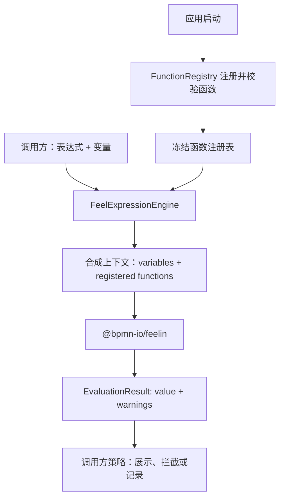

# 前端 FEEL 表达式引擎与自定义函数设计

> 状态：提案
> 范围：前端 `@bpmn-io/feelin` 的表达式求值扩展
> 最后更新：2026-08-14

## 1. 背景与目标

前端以 [`@bpmn-io/feelin`](https://www.npmjs.com/package/@bpmn-io/feelin) 作为 FEEL 解析与解释内核。业务中除了 FEEL 标准内置函数，还需要持续增加业务函数，例如工作日计算、金额计算、编码转换和业务日期判断。

本设计的目标是提供一个可在应用启动时完成配置、运行期稳定复用的 FEEL 表达式引擎：

- 基于 feelin，不重新实现 FEEL parser 或 interpreter；
- 支持注册 N 个经应用批准的自定义函数；
- 对调用方提供 `evaluate` 和 `unaryTest` 两个求值接口；
- 禁止自定义函数覆盖 feelin 的内置函数；
- 调用方传入的变量不得覆盖已注册函数；
- 将函数执行异常转换为与 feelin 兼容的 warning 结果，而不是让异常中断页面；
- 保留 feelin 的 `value + warnings` 结果模型，调用方自行决定 warning 是否应视为失败。

不在本设计范围内：运行时动态增删函数、执行用户提交的 JavaScript、任意网络访问、DMN 决策表执行，以及改变 feelin 的 FEEL 语义。

## 2. 总体架构



职责边界如下：

| 组件 | 职责 | 不负责 |
| --- | --- | --- |
| `FunctionRegistry` | 函数注册、名称冲突校验、参数元数据、冻结注册表 | FEEL 表达式解析和业务变量管理 |
| `FeelExpressionEngine` | 合成上下文、调用 feelin、统一函数异常和结果契约 | 模板渲染、业务权限判断 |
| `@bpmn-io/feelin` | FEEL 解析、内置函数、表达式和 unary test 执行 | 自定义函数异常的捕获与日志策略 |
| 调用方 | 构造变量、处理 value/warnings、提供日志实现 | 修改已发布引擎的函数集 |

## 3. 生命周期与公开 API

函数仅允许在应用启动阶段注册。初始化完成后，注册表和引擎均不可变；请求处理期间不得增删或替换函数。这使每个应用实例拥有稳定、可测试的函数集，也避免并发请求看到不一致的表达式语义。

推荐的调用形态：

```ts
const engine = FeelExpressionEngine.create([
  {
    name: 'businessDay',
    args: ['baseDate', 'offset'],
    handler: businessDay
  },
  {
    name: 'taxInclusive',
    args: ['amount', 'rate'],
    handler: taxInclusive
  }
]);

const result = engine.evaluate('taxInclusive(price, 0.13)', { price: 100 });
const match = engine.unaryTest('> businessDay(validationToday, 3)', {
  '?': dueDate,
  validationToday
});
```

引擎接口：

```ts
interface FeelExpressionEngine {
  evaluate(expression: string, variables?: FeelVariables): EvaluationResult<unknown>;
  unaryTest(expression: string, variables?: FeelVariables): EvaluationResult<boolean | null>;
}
```

`evaluate` 用于完整 FEEL 表达式。`unaryTest` 用于 FEEL unary test，例如 `> 10`、`[1..5]` 或 `not("closed")`；待比较值由变量 `?` 提供。

公开接口返回 feelin 原生同构的 `EvaluationResult`，不把 warning 自动改写为异常。表单校验可以将 warnings 视为配置错误，预览界面也可以同时显示 `value` 和诊断信息。

## 4. 函数定义与注册规则

函数定义不是裸 JavaScript 函数，而是带有稳定元数据的对象：

```ts
interface FeelFunctionDefinition {
  /** 在 FEEL 表达式中使用的名称。 */
  name: string;
  /** FEEL 命名参数的顺序和名称。 */
  args: readonly string[];
  /** 同步、无副作用或具有明确副作用边界的业务实现。 */
  handler: (...args: unknown[]) => unknown;
}
```

注册表在启动时必须校验：

1. `name` 合法、非空且在当前函数集中唯一。
2. `args` 中的名称非空且不重复。
3. `handler` 是同步函数；feelin 当前的求值接口不等待 `Promise`。
4. `name` 不得与 feelin 的任何内置函数重名，也不得使用为引擎保留的名称。
5. 注册成功后，将 `args` 映射到 feelin 函数的 `$args` 属性，以支持 `fn(amount: 100, rate: 0.13)` 形式的命名参数。

内置函数名清单应随当前锁定的 feelin 版本维护并受测试保护。升级 feelin 时，必须重新校验新版本的内置函数集，防止已注册业务函数与新增内置函数产生冲突。

每次调用的上下文按照以下优先级合成：

```text
调用方 variables < 已冻结的 registered functions < feelin built-ins
```

其中后两层不可被调用方变量覆盖。若输入模型包含同名字段，表达式中该名称仍指向已注册函数；模型字段应由调用方在入参校验中改名或拒绝。

## 5. 函数执行失败与 diagnostics

### 5.1 feelin 的实际行为

当前锁定版本为 `@bpmn-io/feelin@6.1.0`。它会把“函数不存在”和“参数数量/名称不匹配”写入 `warnings`，分别使用 `NO_FUNCTION_FOUND` 与 `FUNCTION_INVOCATION_FAILURE`。

但 feelin 调用自定义函数时没有包裹 `try/catch`。因此若 `handler` 抛出异常，`evaluate` 和 `unaryTest` 会直接向调用方抛出该异常，而不会生成 warning。不能依赖 feelin 原生捕获函数异常。

### 5.2 引擎契约

引擎必须为每个已注册函数添加异常适配器：

```text
handler 抛出异常
  → 适配器保留函数名、原始错误和调用关联信息
  → FeelExpressionEngine 捕获
  → 调用日志端口记录结构化错误
  → 返回 value: null 与 FUNCTION_INVOCATION_FAILURE warning
```

建议的 warning 结构与 feelin 保持同构：

```ts
{
  type: 'FUNCTION_INVOCATION_FAILURE',
  message: "Function 'businessDay' failed: offset must be an integer",
  position: { from: 0, to: expression.length },
  details: {
    template: "Function '{name}' failed: {message}",
    values: { name: 'businessDay', message: 'offset must be an integer' }
  }
}
```

feelin 未向自定义函数暴露当前 AST 节点或 warning 收集器，因此第一版不能可靠得到精确的函数调用位置，使用整个表达式范围。若诊断定位成为需求，可在引擎层解析表达式 AST 并定位函数调用节点；这属于后续增强，不能通过猜测字符串位置实现。

日志记录使用注入的 `FeelExpressionLogger` 端口，而非 `console`。日志至少应包含函数名、表达式 ID（如有）、错误类型和关联 ID；默认不记录完整变量值，避免敏感数据泄露。返回给调用方的 warning 不应包含堆栈或内部实现细节。

## 6. 错误策略与安全边界

| 情况 | 引擎返回 | 日志 |
| --- | --- | --- |
| FEEL 语法错误 | 遵循 feelin 原始行为 | 调用方按场景记录 |
| 未找到函数/变量 | feelin warning | 可按调用方策略记录 |
| 参数不匹配 | feelin `FUNCTION_INVOCATION_FAILURE` warning | 可按调用方策略记录 |
| 自定义函数抛出异常 | 引擎生成 `FUNCTION_INVOCATION_FAILURE` warning，`value = null` | 必须记录结构化错误 |
| 注册期重名、覆盖内置函数、非法定义 | 应用启动失败 | 必须记录配置错误 |

函数必须被视为受信任的应用代码，而不是用户脚本。注册时只接受代码内定义或受应用配置控制的实现。函数应避免隐式读取浏览器时钟、全局可变状态或未经授权的网络资源；若确有这些依赖，应显式通过受控服务或变量注入，以保证测试可复现。

## 7. 测试与验收

至少覆盖以下测试：

1. `evaluate` 能执行变量、FEEL 内置函数和已注册函数。
2. `unaryTest` 能以 `?` 变量执行区间、比较和自定义函数表达式。
3. 自定义函数支持位置参数与命名参数。
4. 注册函数不能被调用变量同名覆盖。
5. 注册同名函数或与 feelin 内置函数重名时，应用初始化失败。
6. 参数不匹配沿用 feelin warning。
7. 自定义函数抛出异常时，不向外抛出；返回 `FUNCTION_INVOCATION_FAILURE` warning，记录一次脱敏结构化日志。
8. 注册表在初始化后不可修改；多次调用不会相互污染上下文。
9. feelin 升级时，内置函数冲突检查和全部契约测试必须通过。

验收标准：应用能够在启动期一次性声明任意数量的自定义函数；运行期的 `evaluate` 与 `unaryTest` 语义稳定；业务函数永不覆盖 FEEL 内置函数；函数异常以可观测、可恢复且与 feelin 结果模型一致的方式返回。

## 8. 实施顺序

1. 实现并测试 feelin 内置函数名称清单和 `FunctionRegistry` 注册校验。
2. 实现不可变 `FeelExpressionEngine`，公开 `evaluate` 与 `unaryTest`。
3. 实现函数适配器、日志端口和异常到 warning 的转换。
4. 将业务函数（如 `businessDay`）迁移为 `FeelFunctionDefinition`。
5. 添加上述契约测试，并在 feelin 依赖升级流程中强制执行。
