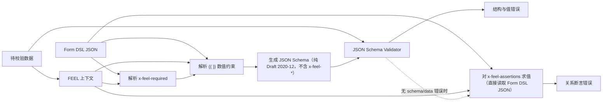

# JSON Schema 与 FEEL 动态校验设计（草案）

> 状态：草案，待下一阶段细化
>
> 范围：前端与 Java 后端共用的表单/数据校验契约
>
> 最后更新：2026-08-17

## 1. 背景与目标

系统需要在前端输入阶段和后端提交阶段对同一份数据执行一致的校验。JSON Schema
适合描述稳定、局部、无需计算的数据约束；FEEL 适合表达依赖当前数据、日期、金额或其他
字段的关系规则。

本设计的目标是：

- 以 **Form DSL JSON** 作为表单/数据规则的权威源，其中同时承载可转写为 JSON Schema 的静态
  结构和 `x-feel-*` 扩展（动态必填、动态数字边界、关系断言）；
- 以 JSON Schema 作为静态结构与基础数据类型校验的共同标准，且始终是从 Form DSL JSON 生成、
  不含任何 `x-feel-*` 扩展的纯 Draft 2020-12 产物；
- 以 FEEL 作为字段关系与动态约束的共同计算语言；
- 在校验前基于 Form DSL JSON 与当前数据，由 FEEL 计算出的动态约束生成一份有效的纯 JSON
  Schema；`x-feel-assertions` 关系断言不进入这份生成的 JSON Schema，而是直接对 Form DSL JSON 求值；
- 保证前端与后端使用相同的扩展语法、求值顺序、错误分类与日期语义；
- 不允许执行任意宿主语言代码，也不允许由请求数据注册或修改表达式函数。

本设计不定义 UI 渲染、字段展示/隐藏、表单状态管理、权限判断或规则编辑器。

## 2. 职责边界

| 规则类型 | 责任方 | 示例 |
| --- | --- | --- |
| 对象、数组、字符串、数字、枚举、固定必填、未知字段 | JSON Schema | `type`、`properties`、`required`、`enum`、`additionalProperties` |
| 固定数值边界 | JSON Schema | `minimum: 0`、`multipleOf: 0.01` |
| 某字段是否必填取决于另一字段 | FEEL + JSON Schema | `email` 在 `data.channel = "email"` 时必填 |
| 数值范围来自当前数据或计算结果 | FEEL + JSON Schema | `maximum: "{{ data.maxAmount }}"` |
| 日期相对今天、相对另一日期、工作日规则 | FEEL | `date(data.dueDate) >= businessDay(clock.today, 1)` |
| 字段互斥、择一、依赖、分支规则 | FEEL | A/B 二选一、状态决定可填字段 |
| 精度/小数位随数据变化（如按币种） | FEEL（`x-feel-assertions` 断言，5.1） | `decimalPlaces(value.amount) <= currencyScale(value.currency)` |
| 字段值是否存在于外部/共享数据源 | FEEL（受控查询函数，8.2） | `existsInReferenceSet("customerId", value.customerId)` |

以下 JSON Schema 关键字不作为产品规则作者表达字段关系的方式：`oneOf`、`anyOf`、
`not`、`dependentRequired`、`if`/`then`/`else`。它们虽然能表示部分条件，但会使条件语言
分散在 JSON Schema 与 FEEL 两处。`allOf` 仅可用于纯静态 schema 复用，不能承载字段关系。

## 3. 校验模型

**Form DSL JSON** 是发布、存储与编辑的权威源：一份既包含可转写为 JSON Schema 的静态结构，
也包含 `x-feel-required`、动态数字关键字（`{{ }}`）、`x-feel-assertions` 等 `x-feel-*` 扩展的
JSON 文档。每次校验从它生成一份**纯 JSON Schema**（标准 Draft 2020-12，不含任何 `x-feel-*`
键、不含任何 `{{ }}` 字符串），交给标准 validator 处理结构与静态/动态数值校验；`x-feel-assertions`
不参与这次生成，而是单独、直接对 Form DSL JSON 求值。



1. 不修改 Form DSL JSON；每次校验据其生成一份新的 JSON Schema，Form DSL JSON 本身不会被
   当作 Schema 直接交给 validator。
2. 以待校验数据和受限、预先注册的 FEEL 函数构造表达式上下文。
3. 执行 Form DSL JSON 中的 `x-feel-required`，将结果为 `true` 的字段名合并到生成的 JSON
   Schema 的 `required`。
4. 解析 Form DSL JSON 数字关键字中以 `{{ ... }}` 标记的 FEEL 表达式；成功求得有限数字后写入
   生成的 JSON Schema 对应关键字的值。
5. 第 3、4 步的输出是一份纯 JSON Schema：`x-feel-required`、`x-feel-assertions`、`{{ }}` 表达式
   字符串都只保留在 Form DSL JSON 里，不会出现在生成的 JSON Schema 中。
6. 使用标准 JSON Schema validator 校验数据；只有在没有 Schema 配置错误且没有数据错误时，才
   对 Form DSL JSON 中的 `x-feel-assertions` 求值——这一步直接读取 Form DSL JSON，不经过第 5 步
   生成的 JSON Schema。
7. 将表达式配置错误与数据校验错误分别返回，不能把前者伪装成用户输入错误。

表达式只能读取本次数据和引擎允许的函数；不得读网络、文件、浏览器/服务器全局状态，
不得修改数据或 Form DSL JSON（8.2 的受控查询函数除外，其边界见 8.2）。

## 4. 条件必填：`x-feel-required`

`x-feel-required` 是 Form DSL JSON 中对象节点上的扩展关键字，与 `required` 同级；它只存在于
Form DSL JSON 里，解析后合并进生成的 JSON Schema 的 `required`，自身不会原样出现在输出中：

```json
{
  "type": "object",
  "required": ["channel"],
  "x-feel-required": {
    "email": "data.channel = \"email\"",
    "phone": "data.channel = \"sms\""
  },
  "properties": {
    "channel": { "type": "string", "enum": ["email", "sms"] },
    "email": { "type": "string", "format": "email" },
    "phone": { "type": "string", "pattern": "^\\+[1-9]\\d{6,14}$" }
  },
  "additionalProperties": false
}
```

处理约定：

- 键为需要动态必填的直接字段名；该字段必须同时出现在当前对象的 `properties` 中。
- 值为返回布尔值的 FEEL 表达式；仅严格等于 `true` 时加入 `required`。
- 静态 `required` 永远保留；动态结果只追加、不删除。
- 语法、未注册函数、运行时 warning、执行异常或结果不是布尔值时，返回 schema 配置错误，终止本次校验。
- 嵌套对象中的动态必填由该嵌套对象自己的 `x-feel-required` 处理；`data`、`value` 的作用域
  与路径规则见 9.2。

## 5. 动态数字关键字

动态边界直接写入字段的标准数字关键字。值为 JSON number 时是静态约束；值为完整的
`{{ ... }}` 字符串时是 FEEL 表达式。花括号以外的任何文本、空表达式以及不是字符串或 number
的值都是 Schema 配置错误。

这使 Form DSL JSON 成为平台的“可动态解析 Schema 定义”，而不是可直接交给通用 validator 的纯
Draft 2020-12 Schema：带表达式的 `minimum` 在解析前确实不通过标准元 Schema。发布期必须先用
平台的 Form DSL JSON 校验器验证 `{{ }}` 形状与 FEEL 语法；每次运行时据其生成的 JSON Schema
则必须是纯 Draft 2020-12 Schema、不含任何 `x-feel-*` 键，并接受标准元校验和数据校验。

```json
{
  "type": "object",
  "properties": {
    "minAmount": { "type": "number" },
    "maxAmount": { "type": "number" },
    "discount": {
      "type": "number",
      "minimum": "{{ data.minAmount }}",
      "maximum": "{{ data.maxAmount }}"
    },
    "strictDiscount": {
      "type": "number",
      "exclusiveMinimum": "{{ data.minAmount }}",
      "exclusiveMaximum": "{{ data.maxAmount }}"
    }
  }
}
```

允许动态化的关键字：

| 关键字 | JSON Schema 含义 | 动态求值后的要求 |
| --- | --- | --- |
| `minimum` | 值大于或等于边界 | 有限数字 |
| `maximum` | 值小于或等于边界 | 有限数字 |
| `exclusiveMinimum` | 值严格大于边界 | 有限数字 |
| `exclusiveMaximum` | 值严格小于边界 | 有限数字 |
| `multipleOf` | 值是该数的倍数 | 大于零的有限数字（v1 不允许动态化） |

一个数字关键字只能有一个值，故静态 number 与动态表达式天然互斥。`minimum` 与
`exclusiveMinimum`、`maximum` 与 `exclusiveMaximum` 也不得同时生效。每个表达式必须求得有限 JSON number；`null`、缺失值、
字符串、NaN 与无穷大表示本次数据无法提供动态边界，属于数据校验错误而非 Schema 配置错误。

动态 `multipleOf` 在 v1 明确禁止。Java 的任意精度十进制与 JavaScript number 的倍数运算
没有天然的一致精度模型；金额等需要精确整除的领域应使用缩放后的整数（例如分）或在 FEEL
关系断言中使用经双方契约测试的十进制函数，不能依赖浮点余数。

### 5.1 数据相关的精度与金额校验

按币种、账户类型等确定的小数位数或金额规则，本质上是“允许的精度随数据变化”，但它不是一个
可以直接赋给 `minimum`/`maximum` 的数字边界，而是一段判断逻辑；动态 `multipleOf` 又已被
禁止。v1 的解决方式是把它写成 `x-feel-assertions` 里的一条断言，由平台注册的确定性函数完成计算，
而不是尝试塞进 JSON Schema 数字关键字：

```json
{
  "id": "discount-scale-matches-currency",
  "assert": "decimalPlaces(value.amount) <= currencyScale(value.currency)",
  "target": "/amount",
  "messageKey": "amount.invalidScale"
}
```

`decimalPlaces`、`currencyScale` 是普通注册函数，遵守 8.1 的确定性、无副作用约束，前后端
必须对同一批金额/币种测试向量得到一致结果。若币种精度表本身来自外部主数据而非随发布固化的
静态表，则应改用 8.2 的受控查询函数，此时错误分类也从“断言不满足”变为“上游依赖错误”
（见 7、9.4）。金额的动态上下限（而非精度）仍按第 5 节的动态数字关键字处理，二者不要混用。

## 6. 日期规则

日期字段的基础结构可使用 JSON Schema 表达，例如 `type: "string"` 与静态必填。但 JSON
Schema 没有可引用另一字段或当前日期的原生日期比较关键字。`format: "date"` 的强制行为依赖
具体 validator 配置；即使应用代码可对有效的 `YYYY-MM-DD` 使用词典顺序比较，也不能替代完整的
日期、时区和工作日业务语义。

因此：

- JSON Schema 只负责日期字段的存在性、字符串类型及其他静态结构；
- 日期格式使用 `format: "date"`，并按 9.1 在前后端都启用 format assertion；
- 大于今天、不早于另一日期、最大跨度、工作日等关系，全部写成 FEEL 规则；
- 今天、当前时间与业务时区只能读取调用方注入的 `clock`，例如
  `businessDay(clock.today, 1)`；前后端不得各自读取本机时间；
- 工作日计算依赖受限的共享函数契约；节假日/补班日历来源与前后端测试向量仍需定义。

## 7. 错误模型

至少区分以下三类错误：

| 类别 | 触发条件 | 面向对象 |
| --- | --- | --- |
| Schema 配置错误 | 非法扩展结构、FEEL 语法/求值失败、动态数字结果非法、关键字冲突 | schema 作者、系统管理员 |
| 数据校验错误 | JSON Schema 对输入数据校验失败 | 表单用户、调用方 |
| FEEL 关系断言错误 | 日期或字段关系表达式返回不满足结果 | 表单用户、调用方 |
| 上游依赖错误 | 受控查询函数（8.2）超时或数据源不可用 | 调用方/运维，可重试 |

上游依赖错误与前三类的关键区别：请求和数据本身可能是合法的，只是本次没能得到确定结果，
不能计入用户的数据错误、不应提示用户"改一下这个值"，调用方应能安全重试。

字段路径、schema 路径、稳定错误码和聚合结构见 9.4；前端与后端必须共享至少一组同构的
契约测试向量。

## 8. 安全与运行时约束

### 8.1 通用约束

- 仅允许平台预注册、确定性、无副作用的 FEEL 函数；例外见 8.2。
- 不执行 JavaScript、Java、反射、脚本或由请求/schema 临时注册的函数。
- schema 和数据都视为不可信输入；扩展关键字必须先完成形状和类型校验。
- 为表达式求值设置复杂度、递归/调用深度与超时/取消策略，具体限额由下一阶段确定。
- 不记录完整敏感数据或表达式上下文；日志仅保留必要的错误码、路径和安全诊断。

### 8.2 受控查询函数（参照完整性 / 数据源校验）

"字段值是否存在于外部数据源"一类校验（如客户号、产品编码是否存在于主数据）无法用静态
`enum` 表达，也不满足 8.1 默认的"无副作用、不访问网络"约束。v1 为此开放一类特例——**受控
查询函数**（如 `existsInReferenceSet`、`lookupMasterData`），仅在满足以下条件时允许使用：

- 函数必须由平台预先注册并审计；Form DSL JSON 与请求数据只能提供查询键（字段值、参照集合的
  逻辑名等），不能提供目标地址、库名、SQL 或任何决定"查询谁"的内容；
- 每个函数在注册时已绑定唯一确定的数据源与查询方式；同一函数名在不同环境指向不同物理
  地址属于部署配置，不是运行时可变的输入；
- 必须有强制的超时、重试上限与降级策略；查询超时或数据源不可用不等价于"值不满足"，需归入
  独立的"上游依赖错误"类别（见 7、9.4），不得伪装成 `assertion.failed`；
- 返回值只能是校验所需的布尔值或受限枚举，不得把数据源中其他字段透传进错误信息或日志；
- 同一次校验内对同一函数、同一查询键的重复调用应去重或缓存，避免重复外部查询放大延迟。

受控查询函数的注册清单、签名规范、超时/重试/降级细节与审计要求留待第 10 节实施阶段确定。

## 9. 建议冻结的 v1 契约

本节将此前影响互操作性的待决项收敛为建议的 v1 基线；实现开始前应以一组共享测试向量
确认所选依赖版本的实际行为。

### 9.1 Dialect 与 validator

- 所有发布的 Form DSL JSON 必须声明 Draft 2020-12 的 `$schema` 和稳定的 `$id`；含 `{{ }}` 的
  Form DSL JSON 是平台扩展格式，只有据其生成的 JSON Schema 才是标准 Draft 2020-12 Schema，
  且不包含任何 `x-feel-*` 键。
- 前端使用 `ajv/dist/2020` 与 `ajv-formats`；AJV 必须启用 strict mode，且只能加载已生成的
  Draft 2020-12 JSON Schema。AJV 不能在同一个实例中混用 Draft 2020-12 和旧 draft。
- Java 使用 networknt `json-schema-validator` 的 Draft 2020-12 dialect，并缓存发布的 Form DSL
  JSON 及其已验证的生成计划；请求不得提供 `$id`、`$ref` URI 或 Schema 内容来影响加载。
- 两端都将 `format` 作为断言，允许的 format 白名单为 `date`、`date-time`、`email`、`uri`。
  未知 format 在发布时即为配置错误。Draft 2020-12 默认仅把 format 当作 annotation，因此此项
  必须由 AJV 配置和 Java 执行配置显式开启。

### 9.2 FEEL 作用域与路径

每次 FEEL 求值只提供下列只读变量，禁止把业务字段摊平为 FEEL 顶层变量：

| 变量 | 值 | 用途 |
| --- | --- | --- |
| `data` | 整个待校验 JSON 数据 | 跨层或根字段读取，如 `data.applicant.age` |
| `value` | 当前承载扩展关键字的对象 | 当前对象字段读取，如 `value.channel` |
| `clock` | 调用方注入的 `{ today, now, timeZone }` | 时间相关规则；禁止直接读机器时钟 |

这避免字段名覆盖 FEEL 内置函数或平台注册函数，也让嵌套对象与数组有唯一语义。`x-feel-required`
和 `x-feel-assertions` 位于 Form DSL JSON 的对象节点时，`value` 是该对象；数组 `items` 内对象同理。
动态边界位于字段节点时，`value` 是该字段的父对象。数组项的当前项不引入额外隐式变量；需要引用
它时，规则应位于 items 对象上并使用 `value`。

扩展的 `target` 使用相对当前对象的 RFC 6901 JSON Pointer，例如 `/dueDate`；空字符串表示当前
对象。它只能指向当前对象内已声明的 `properties` 路径，不能通过 `..` 或其他相对路径离开当前
对象。

### 9.3 FEEL 关系断言：`x-feel-assertions`

Form DSL JSON 的对象节点可以声明不适合转写成标准 JSON Schema 的断言。`x-feel-assertions` 只存在于
Form DSL JSON 中，不会被写入第 3 节生成的 JSON Schema；校验时直接对 Form DSL JSON 里的规则
数组求值，不对生成的 JSON Schema 做二次解析：

```json
{
  "type": "object",
  "x-feel-assertions": [
    {
      "id": "due-date-not-before-tomorrow",
      "assert": "date(value.dueDate) >= businessDay(clock.today, 1)",
      "target": "/dueDate",
      "messageKey": "dueDate.notBeforeNextBusinessDay"
    }
  ]
}
```

- `id` 在整个发布 Form 版本中唯一，且由 `[A-Za-z][A-Za-z0-9._-]{0,127}` 限制。
- `assert` 必须严格求值为 `true` 才通过；`false` 产生 FEEL 关系断言错误。warning、非布尔值或
  执行异常都属于 Schema 配置错误。
- `target` 必填，用于稳定定位 UI 字段；`messageKey` 必填，只是消息目录的键，Schema 不保存可被
  直接展示的自由文本。
- 标准 JSON Schema 先执行；只有没有 Schema 配置错误且没有数据错误时才执行关系断言。这使关系
  断言只面对已满足基础类型和必填约束的数据，避免把用户的缺失值或错误类型误报为断言配置失败。

### 9.4 统一错误对象

所有错误均以 JSON Pointer 报告路径，数组顺序与执行顺序一致。对外不返回 FEEL 堆栈、原始
数据或底层 validator 的本地化消息。

```json
{
  "category": "data",
  "code": "data.required",
  "instancePath": "/email",
  "schemaPath": "#/required",
  "keyword": "required",
  "assertionId": null,
  "messageKey": "validation.required",
  "arguments": { "property": "email" }
}
```

`category` 只能为 `schema`（发布或动态解析失败）、`data`（标准 JSON Schema 不满足）、
`assertion`（`x-feel-assertions` 断言为 false）或 `upstream`（8.2 受控查询函数超时/数据源
不可用）。错误码的 v1 最小集合是：
`schema.extensionShape`、`schema.feelSyntax`、`schema.feelEvaluation`、
`schema.feelResultType`、`schema.conflictingBound`、`data.dynamicBound`、
`data.<keyword>`、`assertion.failed`、`upstream.lookupTimeout` 与
`upstream.lookupUnavailable`。`schema` 类错误终止请求并以服务端故障处理；`data` 和
`assertion` 类错误可聚合并返回调用方；`upstream` 类错误应单独标出、允许调用方重试，不与
`data`/`assertion` 错误合并计数或提示用户修改数据。

## 10. 剩余实施事项

1. 为 Form DSL JSON 编写发布期校验器：它必须验证 `{{ }}` 形状、允许使用的动态数字关键字、
   FEEL 语法、引用的函数与 `target` 路径；不能等到用户提交数据才发现。
2. 定义日期值模型、`clock` 的 JSON 形状、`businessDay` 的节假日/补班日历来源，并建立前后端
   相同的测试向量。
3. 定义“字段缺失或类型无效时关系断言应显式短路”的标准写法，并实现错误去重策略。
4. 编写包含嵌套对象、数组项、format、动态边界、断言失败和配置失败的公共 JSON fixture；Java
   和 TypeScript 两套测试必须消费同一份 fixture。
5. 基于上述契约设计 Java 后端实现与前端适配层。
6. 定义受控查询函数（8.2）的注册机制、函数签名规范、超时/重试/降级策略、审计日志要求，以及
   `upstream` 错误在网关/前端的重试与提示策略。
7. 定义 `decimalPlaces`、`currencyScale`（5.1）等精度相关函数的语义、支持币种/精度表的来源
   与更新流程，并明确该表本身是否需要退化为 8.2 的受控查询函数。
8. 补充 `upstream` 错误类别的前后端契约测试向量（超时、数据源不可用、部分失败等场景）。
